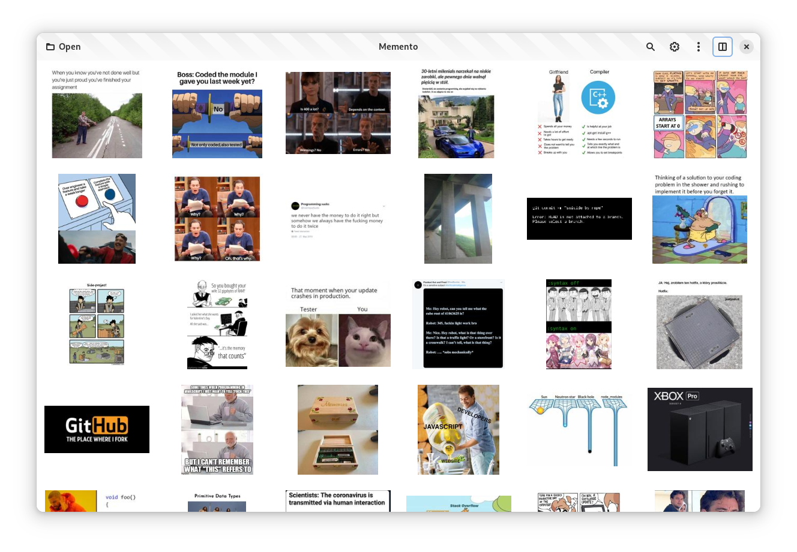

# Memento
> /məˈmɛntoʊ/

Meme browser, search and tagger

## Demo
https://github.com/SelfRef/memento/assets/69125050/c1f41c03-7060-4929-8a4e-13588ca22c91

## Screenshots
List | Preview
---|---
 | 

## Features (incomplete)
- Browse your meme folder recursively
- Cache generation (loads faster second time)
- Preview panel with image details
- Search function based on filename and tags
- Build-in OCR tagging (allows to search for image text)
- More to come: [planned features](https://github.com/SelfRef/memento/labels/enhancement), [project roadmap](https://github.com/users/SelfRef/projects/4)

## Status
This project is in development state, not for daily use yet.

## Setup

### Requirements
- GTK 4
- libadwaita
- Python 3
- blueprint-compiler
- pillow (PyPI, required)
- unidecode (PyPI, requred)
- easyocr (PyPI, optional for OCR feature)

### Run
- Install requirements
- Clone repo
- Open VS Code workspace
- Run debugger or default build task
