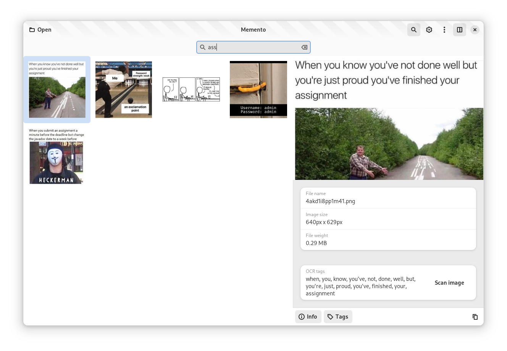

# Memento
> /məˈmɛntoʊ/

Meme browser, search and tagger

## Demo
[demo.webm](https://github.com/SelfRef/memento/assets/69125050/2e6b779f-91ea-4a8d-8982-8dbe896568ea)

## Screenshots
List | Preview
---|---
 | 

## Features (incomplete)
- Browse your meme folder recursively
- Cache generation (loads faster second time)
- Preview panel with image details
- Search function based on filename and tags
- Build-in OCR tagging (allows to search for image text)

## Status
This project is in development state, not for daily use yet.

## Setup

### Requirements
- GTK 4
- libadwaita
- Python 3
- blueprint-compiler
- pillow (PyPI, required)
- unidecode (PyPI, requred)
- easyocr (PyPI, optional for OCR feature)

### Run
- Install requirements
- Clone repo
- Open VS Code workspace
- Run debugger or default build task
